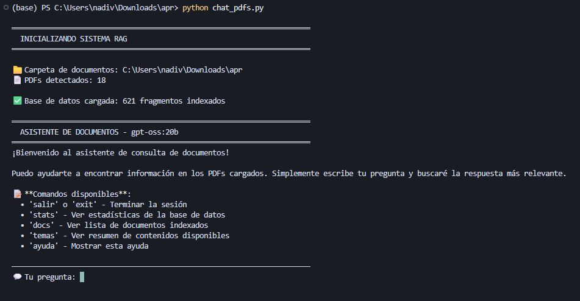
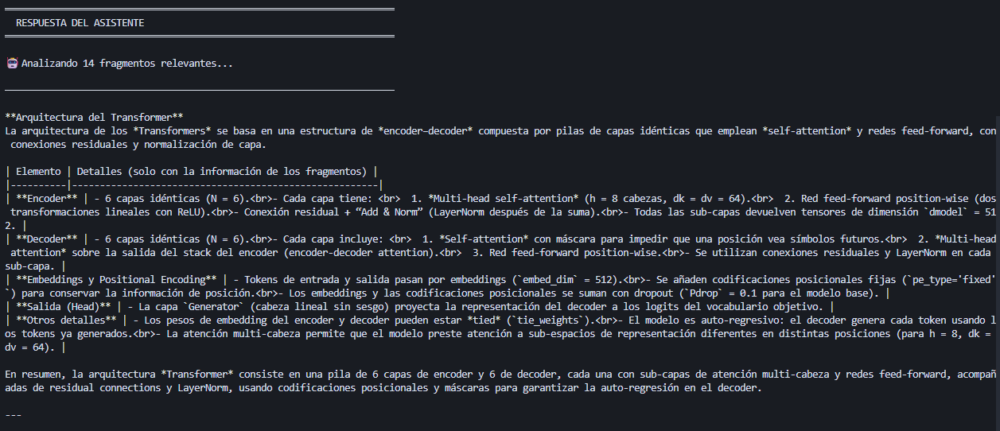
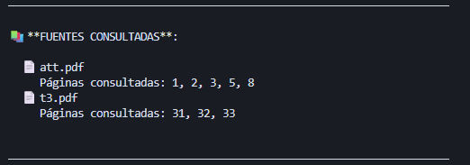

# PDF RAG Chat

A local RAG (Retrieval Augmented Generation) chatbot that answers questions from your PDF documents using Ollama and ChromaDB.



## Features

- **Hybrid Search**: Combines semantic search with keyword matching for better retrieval
- **Accurate Citations**: Shows exact document and page number for each answer
- **Persistent Database**: ChromaDB stores embeddings locally, no re-processing needed
- **Streaming Responses**: Real-time answer generation
- **Friendly UX**: Helpful messages when information isn't found

## Requirements

- Python 3.8+
- [Ollama](https://ollama.ai/) running locally

## Installation

```bash
pip install ollama chromadb pypdf
```

Pull the required models in Ollama:

```bash
ollama pull nomic-embed-text
ollama pull <your-chat-model>  # e.g., llama3, mistral, etc.
```

## Configuration

Edit the model names at the top of `chat_pdfs.py`:

```python
MODELO_CHAT = "llama3"              # Your chat model
MODELO_EMBEDDING = "nomic-embed-text:latest"  # Embedding model
```

## Usage

1. Place your PDF files in the same folder as the script
2. Run the script:

```bash
python chat_pdfs.py
```

3. On first run, PDFs are automatically indexed
4. Ask questions about your documents

### Commands

| Command | Description |
|---------|-------------|
| `temas` | Show summary of indexed content |
| `docs` | List indexed documents |
| `stats` | Database statistics |
| `ayuda` | Help |
| `salir` | Exit |

## Screenshots

### Hybrid Search in Action
The system combines semantic and keyword search to find the most relevant fragments:


### Assistant Response
Answers are generated based on the retrieved context:



### Source Citations
Every answer includes exact document and page references:



## How It Works

```
┌─────────────┐    ┌──────────────┐    ┌─────────────┐    ┌──────────────┐
│  PDF Files  │───▶│   Chunking   │───▶│  Embeddings │───▶│   ChromaDB   │
└─────────────┘    └──────────────┘    └─────────────┘    └──────────────┘
                         │
                   800 chars/chunk
                   200 chars overlap
```

### Indexing Pipeline

1. PDFs are extracted using `pypdf`
2. Text is split into **overlapping chunks** (800 chars with 200 overlap) to preserve context across boundaries
3. Each chunk is converted to a vector embedding using `nomic-embed-text`
4. Embeddings are stored in ChromaDB with metadata (source file, page number, chunk index)

### Hybrid Retrieval System

The search combines three strategies using **Reciprocal Rank Fusion (RRF)**:

| Strategy | Description | Weight |
|----------|-------------|--------|
| **Semantic Search** | Vector similarity using embeddings | 60% |
| **Keyword Search** | Exact term matching with variants | 40% |
| **Exhaustive Search** | Full-text scan for critical technical terms | Boost |

```
User Query
    │
    ├──▶ Semantic Search (embedding similarity)
    │         │
    ├──▶ Keyword Search (exact matches + variants)
    │         │
    └──▶ Exhaustive Search (technical terms)
              │
              ▼
        RRF Fusion ──▶ Top-K Chunks ──▶ LLM Generation
```

### Query Expansion

- Multiple query variants are generated automatically
- Technical terms are expanded (e.g., "attention" → "query", "key", "value", "softmax")
- Keywords are searched in multiple forms (lowercase, uppercase, capitalized)

### Context Assembly

- Top 12 chunks are selected based on combined score
- Adjacent chunks are retrieved to provide surrounding context
- Final context is formatted with clear source citations for the LLM

## License

MIT
